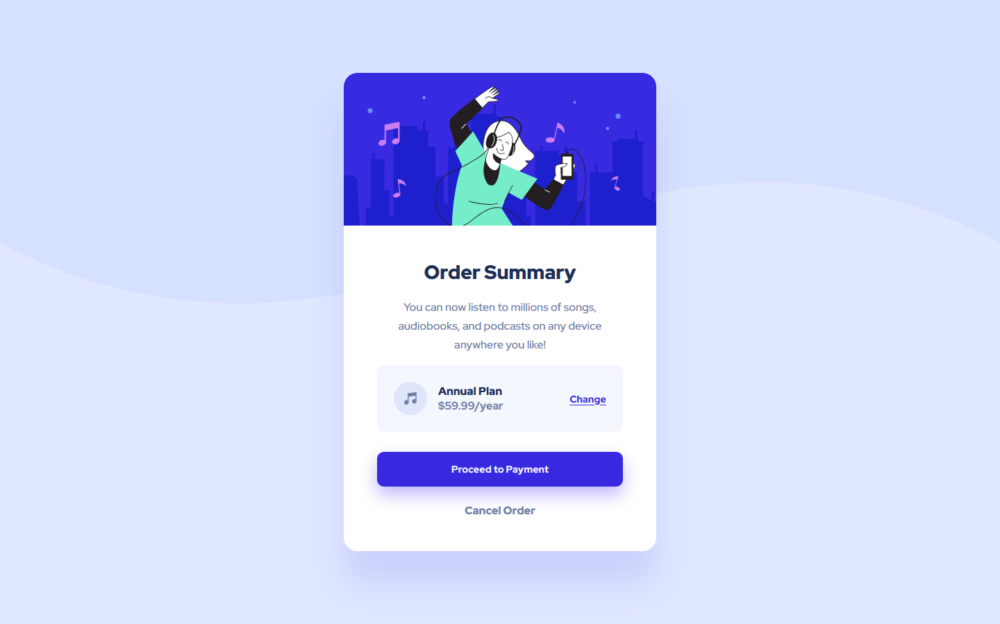

# My third project and solution to the order summary component challenge over at [Frontend Mentor](https://www.frontendmentor.io/challenges)

## This was the assignment

## This is my solution

[Click here to see the live page](https://arthurpog.github.io/order-summary-component/)

This is my *third* challenge from Frontend Mentor.

I had **2 big issues** with this one.

- Grouping 2 of three elements in a row together while silmultaneously having the whole row justified and taking up the whole width of the container it is in

I haven't solved this one.

- Keeping the whole content vertically centered and then sticking the top of the main div to the top of the screen and enabling scrolling when the viewing height becomes too short to fit the screen without cutting away at the containers

I solved this by having conditional CSS that basically completely changes the rule set when the height of the screen changes beyond a set limit. This is definitely not an elegant solution. I'll be keeping my eyes open for something better.

[SOLVED]:

- First issue: Three element grouping fixed by using a combination of correctly created groups with divs and the display: flex property. This is of course one of the solutions, I am pretty sure I saw someone fix this with grids a while back.

- Second issue: The vertical centering was solved with:

    `min-height: 100vh;` 
    `display: flex;` 
    `align-items: center;` 
    `justify-content: center;` 

    This following solution was not elegant:

    `position: absolute;` 
    `top: 50%;` 
    `left: 50%;` 
    `transform: translate(-50%, -50%);` 

    The reason for that is it causes glitches when the viewport is shorter in height than the content.
